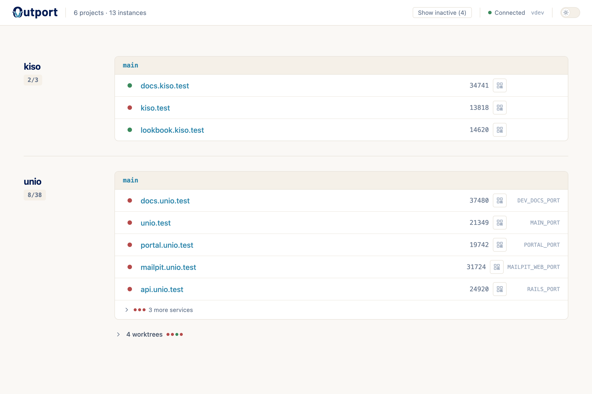
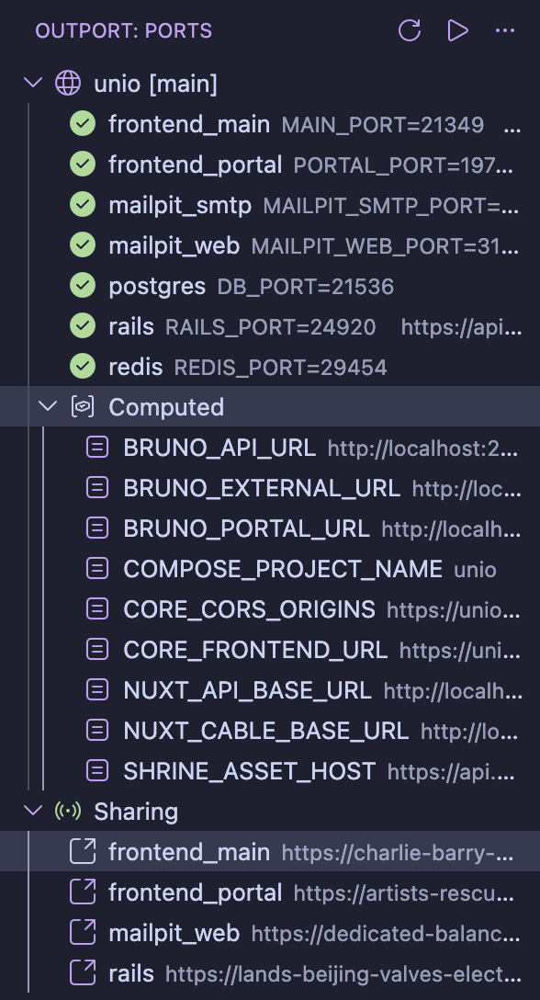

<p align="center">
  <a href="https://outport.dev">
    
  </a>
</p>

# Outport

**Port orchestration for multi-project development.**

Outport allocates deterministic, non-conflicting ports for all your projects, assigns `.test` hostnames with HTTPS, and writes everything to `.env`. No more port conflicts. No more memorizing port numbers. No more cookie collisions across parallel instances.

> **[Full documentation at outport.dev](https://outport.dev)**

## The Problem

You're running Rails on 3000, Nuxt on 9000, Postgres on 5432. You start a second project — port conflict. You spin up another instance for an AI agent — more conflicts. Your Nuxt frontend needs your Rails API URL. Your Rails backend needs the frontend URL for CORS. You're juggling port numbers across `.env` files, and if you get one wrong, nothing works.

Outport fixes this. Declare your services once in `outport.yml`, check it into your repo, and run `outport up`. Every developer, every machine, every instance gets deterministic ports — no coordination required.

## Install

```bash
curl -fsSL https://outport.dev/install.sh | sh
```

Or with Homebrew:

```bash
brew install steveclarke/tap/outport
```

See all [installation options](https://outport.dev/guide/installation) including .deb/.rpm packages and building from source.

## Quick Start

```bash
outport setup         # One-time setup (optional .test domains + HTTPS)
outport init          # Create outport.yml
vim outport.yml       # Define your services
outport up            # Allocate ports, write .env
```

After `outport up`, your `.env` has deterministic ports and your services are accessible at friendly hostnames:

```
myapp [main]

    web       PORT        → 24920  https://myapp.test
    postgres  DB_PORT     → 21536
    redis     REDIS_PORT  → 29454
```

That's it. Outport writes finished environment variables to `.env` — every framework that reads `.env` works with zero configuration. Monorepos with separate `.env` files per service work too — each service can target a different file.

> [!NOTE]
> See the [Getting Started guide](https://outport.dev/guide/getting-started) for a full walkthrough.

## Features

### .test Domains with HTTPS

Run `outport system start` once to enable `.test` hostnames. This installs a local DNS server, reverse proxy, and CA — your services become accessible at `https://myapp.test` instead of `http://localhost:24920`. The proxy starts at login and updates routes automatically. Services that respond to multiple hostnames (e.g., subdomain routing) can declare [aliases](https://outport.dev/reference/configuration#aliases) — additional `.test` hostnames routed to the same port.

### Multiple Instances

Every clone, worktree, or checkout is an **instance**. The first is "main" — additional instances get auto-generated codes with their own ports and hostnames (`myapp-bkrm.test`).

### Computed Values

Port numbers alone aren't enough. Your Nuxt frontend needs your Rails API URL. Your Rails backend needs the frontend origin for CORS. These values depend on each other — and they change when ports change.

```yaml
computed:
  API_URL:
    value: "${rails.url}/api/v1"
    env_file: frontend/.env
  CORS_ORIGINS:
    value: "${frontend.url}"
    env_file: backend/.env
```

Outport resolves these from your service map and writes finished values to `.env` — not port numbers, but complete URLs your app can use directly. When ports change, URLs update automatically. When you spin up a second instance, everything rewires to the new ports and hostnames.

See the [Configuration reference](https://outport.dev/reference/configuration) for template syntax and examples.

### Dashboard

Open `https://outport.test` for a live dashboard showing all your projects, services, ports, and health status. Updates in real-time as you run `outport up` across projects.



See the [Dashboard guide](https://outport.dev/guide/dashboard).

### Sharing and Mobile Access

`outport share` tunnels your HTTP services to public URLs via Cloudflare. `outport qr` shows QR codes for testing on mobile devices over your local network.

See the [Sharing & Mobile guide](https://outport.dev/guide/sharing) for setup details.

### VS Code Extension

The [Outport for VS Code](https://outport.dev/guide/vscode) extension shows ports, URLs, and service health in the editor sidebar with clickable links.



### AI Agent Support

Install the Outport skill so your AI coding agent knows how to configure ports:

```bash
npx skills add steveclarke/outport/skills
```

See [Work with AI](https://outport.dev/guide/work-with-ai) for example prompts and what's included.

## All Commands

All commands support `--json` for machine-readable output.

```
outport setup              One-time system setup
outport init               Create outport.yml
outport up [--force]       Allocate ports, write .env
outport down               Remove ports, clean .env
outport status [--computed] Show project status
outport open               Open services in the browser
outport qr [--tunnel]      QR codes for mobile access
outport share [service]    Tunnel services to public URLs
outport rename [old] <new> Rename an instance
outport promote            Promote instance to main
outport doctor             Diagnose issues
outport system start       Install DNS, HTTPS, start daemon
outport system stop|restart|status|prune|uninstall
outport completion [shell] Generate shell completions
```

See the [Commands reference](https://outport.dev/reference/commands) for full details.

## Development

Requires [Go 1.26+](https://go.dev/dl/) and [just](https://github.com/casey/just).

```bash
just build        # Build the binary
just test         # Run all tests
just lint         # Run linter
just run up       # Build and run with args
```

## Roadmap

- ~~**v1:** Port allocation + `.env` writing~~
- ~~**v2:** DNS server + reverse proxy for `.test` domains, instance model~~
- ~~**v3:** Local HTTPS with automatic certificates for `.test` domains~~
- ~~**v4:** QR codes for mobile device access~~
- ~~**v5:** Public URL sharing via Cloudflare Tunnel with multi-service orchestration~~
- ~~**v6:** Linux support (systemd, systemd-resolved, distro CA trust)~~

## License

MIT
